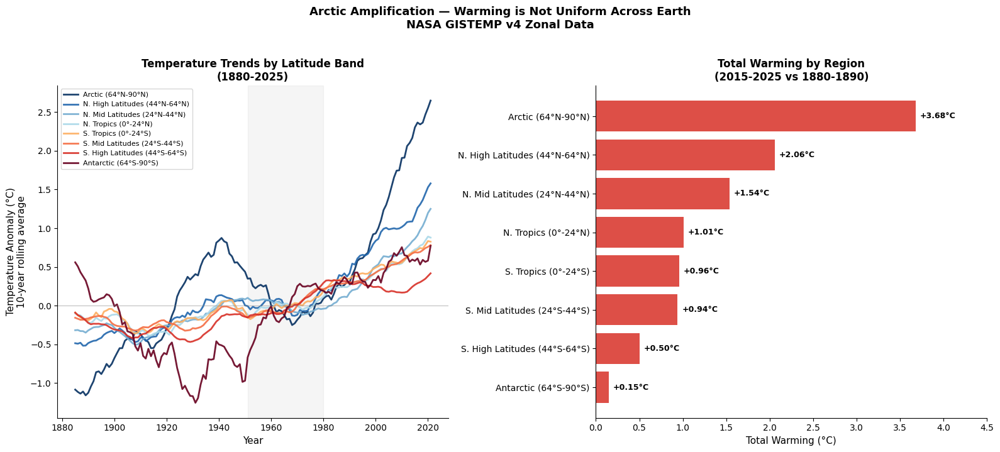
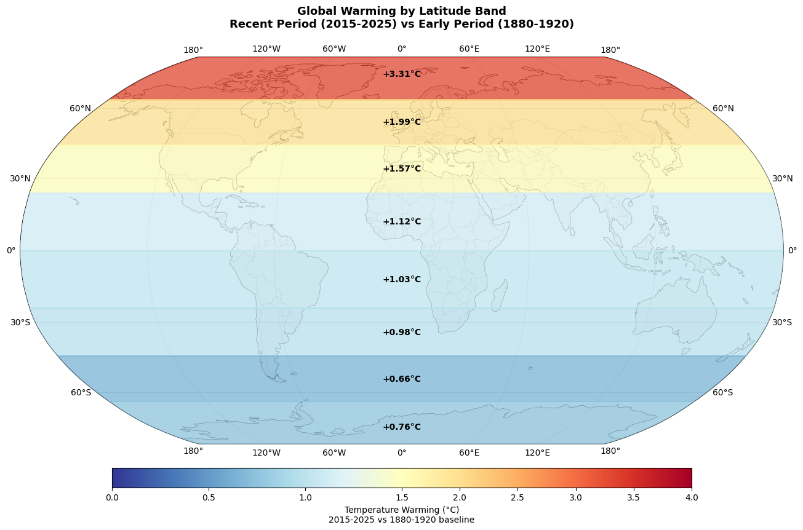
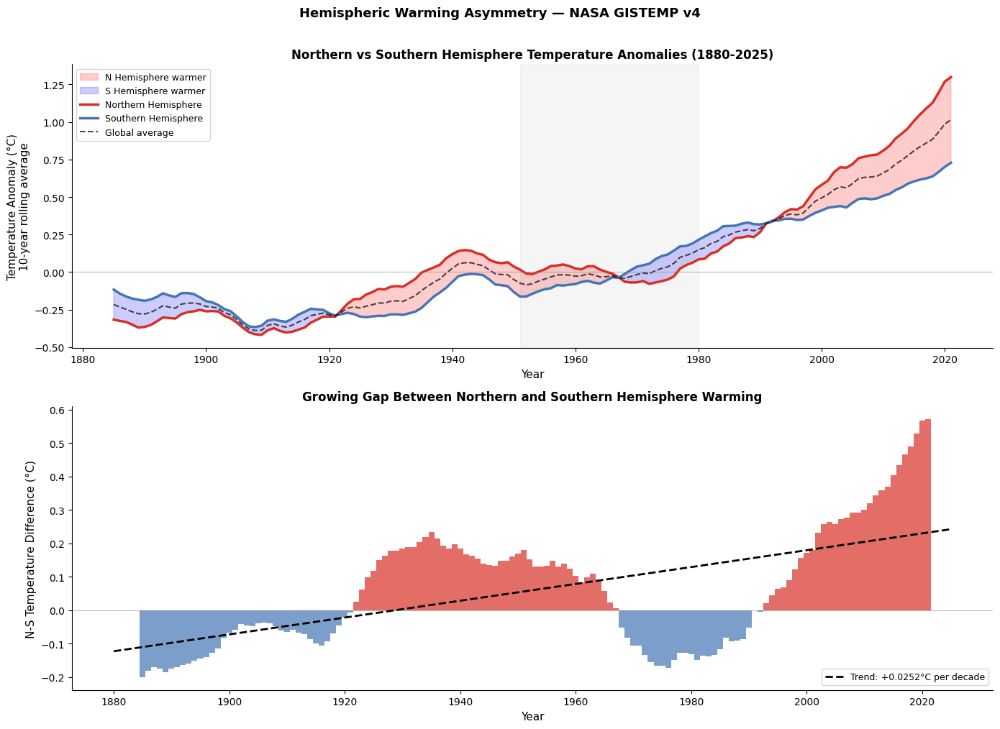
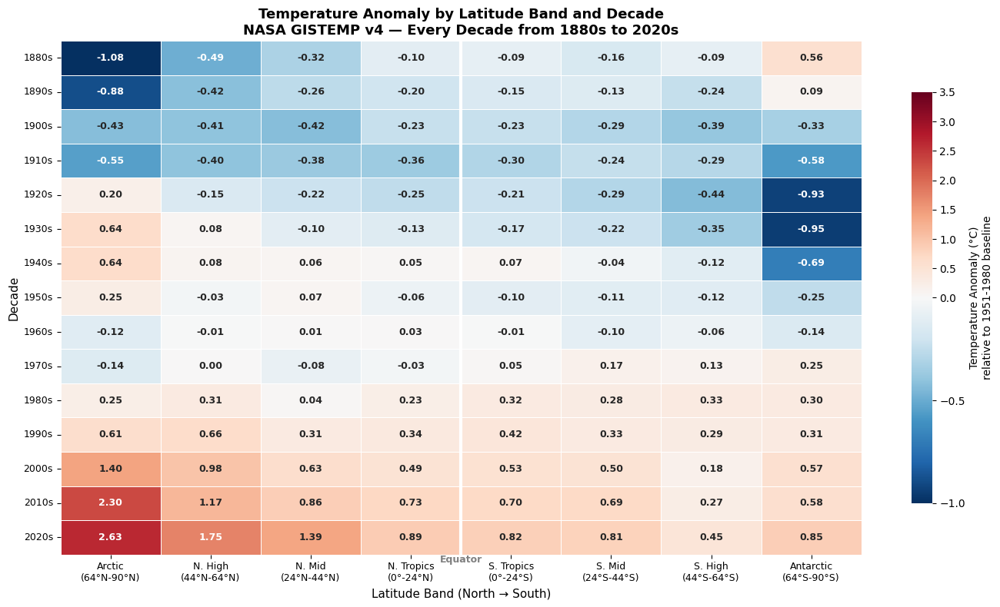

# NASA GISTEMP Geospatial Analysis
### Mapping Global Temperature Anomalies with Cartopy and GeoPandas

**Author:** Emma Follis  
**Data source:** [NASA GISS Surface Temperature Analysis (GISTEMP v4)](https://data.giss.nasa.gov/gistemp/)  
**Tools:** Python, pandas, numpy, scipy, matplotlib, seaborn, Cartopy, GeoPandas  
**Last updated:** June 2026

[](https://colab.research.google.com/drive/1yAfO8dW7O_8vVuQVvxuK0RqGR26LYYpD?usp=sharing)

---

## Overview

This project extends temporal climate analysis into spatial analysis - mapping 
*where* on Earth warming is most dramatic, not just *when*. Using NASA's GISS 
zonal temperature dataset, temperature anomalies are analyzed across eight 
latitude bands from the Arctic to the Antarctic, covering 145 years from 1880 
to 2025.

The analysis covers four questions:

1. Which latitude bands have warmed the most since 1880?
2. How does the spatial pattern of warming look on a world map?
3. How differently are the Northern and Southern hemispheres warming?
4. How has warming in each latitude band changed decade by decade?

---

## Key Findings

**Arctic amplification is real and dramatic:** The Arctic (64°N-90°N) has warmed 
+3.68°C since 1880-1890 - nearly four times the global average. The Antarctic 
has warmed only +0.15°C over the same period, a 24x difference between the poles.

**Hemispheric divergence is growing:** The Northern Hemisphere has warmed +1.612°C 
since 1880-1890 versus +0.854°C for the Southern Hemisphere - nearly twice as much. 
The gap between hemispheres is widening at +0.0252°C per decade.

**Warming is not uniform across latitudes:** Tropical regions show the most 
consistent warming signal with low year-to-year variability, while polar regions 
show higher variability but stronger long-term trends.

**The 1960-1980 cooling dip in the Northern Hemisphere** corresponds to a period 
of industrial aerosol pollution that temporarily offset greenhouse warming - a 
real signal visible in the hemispheric divergence chart.

---

## Visualizations

### Visualization 1: Warming by Latitude Band

*Left: 10-year rolling average temperature trends for all 8 latitude bands 
from 1880-2025. Right: Total warming per region comparing 2015-2025 vs 1880-1890.*

---

### Visualization 2: Global Warming Map

*Robinson projection world map showing total warming by latitude band. 
The red-to-blue color gradient reveals Arctic amplification at a glance.*

---

### Visualization 3: Hemispheric Warming Asymmetry

*Top: Northern vs Southern Hemisphere temperature anomalies with filled area 
showing which hemisphere is warmer at each point in time. Bottom: The growing 
gap between hemispheres with linear trend.*

---

### Visualization 4: Polar Amplification Heatmap

*Every latitude band × every decade since 1880 in one visualization. 
The transition from deep blue in the Arctic column in the 1880s to deep 
red in the 2020s tells the entire story of Arctic amplification.*

---

## Repository Structure
```NASA_GISTEMP_Geospatial_Analysis/

├── NASA_Earthdata_Geospatial_Analysis.ipynb   # Full analysis notebook

├── lat_band_warming.png                        # Visualization 1

├── global_warming_map.png                      # Visualization 2

├── hemisphere_comparison.png                   # Visualization 3

├── polar_amplification_heatmap.png             # Visualization 4

└── README.md                                   # This file
```
---

## How to Run

**Option 1 — Google Colab (recommended):**  
Click the Open in Colab badge above. Download the NASA GISS Zonal Temperature 
file from [NASA GISS](https://data.giss.nasa.gov/gistemp/tabledata_v4/ZonAnn.Ts+dSST.csv) 
and upload it when prompted.

**Option 2 — Local:**
```bash
pip install pandas numpy scipy matplotlib seaborn cartopy geopandas
jupyter notebook NASA_Earthdata_Geospatial_Analysis.ipynb
```

Note: Cartopy installation can sometimes require additional system dependencies. 
See [Cartopy installation guide](https://scitools.org.uk/cartopy/docs/latest/installing.html) 
if you encounter issues.

---

## Data Notes

- Dataset: NASA GISS Surface Temperature Analysis (GISTEMP v4) Zonal Means
- Temperature anomalies relative to 1951-1980 baseline
- Retrieved: June 2026
- 145 complete years (1880-2025)
- 8 latitude bands plus global, Northern, and Southern hemisphere averages
- File requires skiprows=1 and manual column assignment on load

---

## New Skills Demonstrated

Compared to previous projects this notebook introduces:
- Cartopy for geographic map projections (Robinson projection)
- GeoPandas for spatial data handling
- TwoSlopeNorm for diverging color scales centered on zero
- Zonal/gridded scientific data formats
- Spatial pattern analysis across latitude bands

---

## About

Built as part of a scientific data analysis portfolio by Emma Follis, a data analyst 
with a background in Earth and Planetary Science. Currently completing an M.S. in 
Space Studies at American Public University while contributing to NASA's Exoplanet 
Watch citizen science program.

[LinkedIn](https://www.linkedin.com/in/emma-follis) |
[GitHub](https://github.com/AstroAstra)
